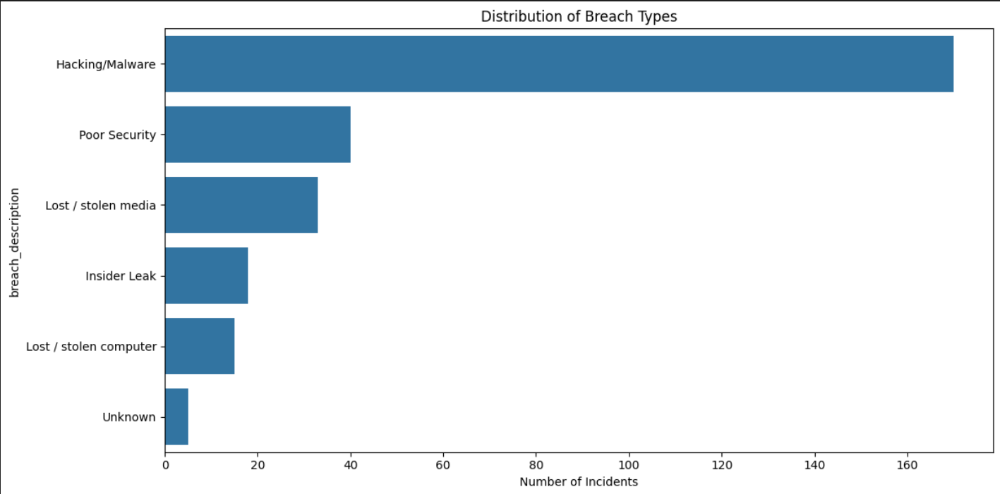
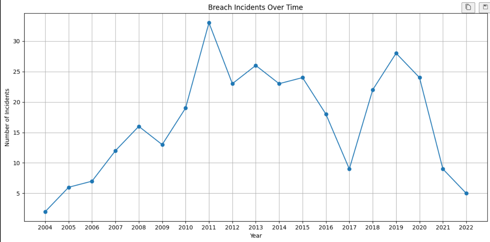
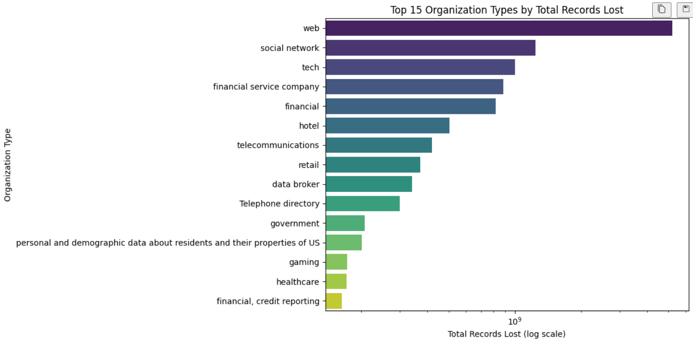
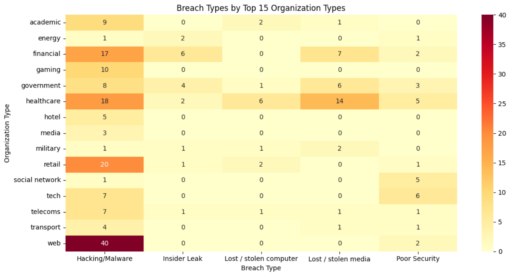

# Data Breach Analysis

This project analyzes and visualizes cybersecurity breach incidents using Python. It provides insights into breach types, trends over time, organizational impact, and risk metrics based on real-world breach data with various data visualizations.

## Process
- Data cleaning and preprocessing
- Statistical summaries
- Visualization of breach types, timelines, and organizational impact
- Heatmaps of breach types by organization
- Calculation of organizational risk metrics
- Key findings and summary statistics

## Project Structure

- `data_breach_analysis.ipynb` — Main analysis notebook
- `df_1.csv` — Source data file (source: https://www.kaggle.com/datasets/thedevastator/data-breaches-a-comprehensive-list)
- `README.md`

## Requirements

1. **Install dependencies:**
   ```sh
   pip install pandas matplotlib seaborn numpy
   ```

2. **Add your data:**
   Add the data breach CSV file as `df_1.csv` in the project directory.

3. **Run the analysis:**
   Open `data_breach_analysis.ipynb` in Jupyter Notebook or VS Code and run all cells.

## Example Visualizations

Below are the screenshots of the data visualizations generated by this notebook.

**1. Distribution of Breach Types**  


**2. Breach Incident Frequency Over Time**  


**3. Top 15 Organizations by Total Records Lost**  


**4. Heatmap of Breach Types by Top 15 Organization Types**  



